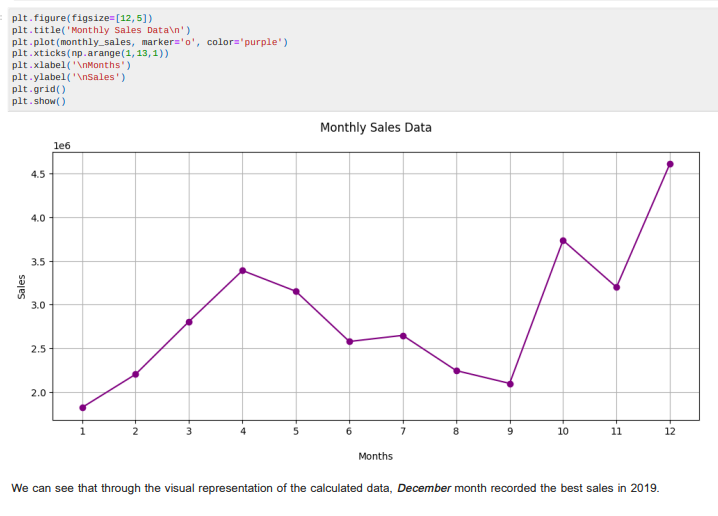

# Annual Sales Analysis EDA

## Project Overview

The "Annual Sales Analysis" project involves the analysis of sales data for a XYZ company across 12 different months. The project includes data cleaning, data preprocessing, data exploration, and visualization to answer key business questions related to the sales data.

## Project Tasks

The following tasks were performed during this project:

1. **Data Collection**: Sales data was collected from 12 different CSV files.

2. **Data Merging**: All 12 CSV files were merged into a single CSV to create a consolidated dataset.

3. **Data Cleaning**: Data cleaning was performed to handle missing values (NaN) and ensure data quality.

4. **Data Preprocessing**: Various data preprocessing techniques were applied, including changing column value types, adding new columns, and parsing cells as strings to create new features.

5. **Data Analysis Techniques**:
    - The `.apply()` method was used for data transformation.
    - `groupby` was employed for aggregate analysis.
    
6. **Data Visualization**:
    - Bar charts and line graphs were created to visualize the results.
    - Graphs were labeled for clarity and interpretation.

## Business Questions Explored

The project explored the following high-level business questions related to the sales data:

1. **Best Month for Sales**: Identify the best month for sales and determine the total earnings for that month.
   

2. **Top-Performing City**: Determine which city sold the most products.
   

3. **Optimal Advertisement Timing**: Analyze the data to find the best time to display advertisements to maximize the likelihood of customer purchases.
   

4. **Frequently Sold Products**: Identify products that are most often sold together.
   

5. **Top-Selling Product**: Determine the product that sold the most and provide insights into why it achieved the highest sales.
   - 
   - 

## Tools and Libraries

The project was developed using Jupyter Notebook, a popular environment for data analysis and visualization. The following libraries were used:

- NumPy: For numerical operations.
- Pandas: For data manipulation and analysis.
- Matplotlib.pyplot: For data visualization.

## Usage

To explore and reproduce the results of this project, follow these steps:

1. Clone the project repository.

2. Open the Jupyter Notebook file provided in the repository.

3. Run the notebook cells to execute the analysis and visualize the results.

## License

This project is open for reuse. You are free to use, modify, and distribute this project in accordance with the terms of the [License Name or Link]. There are no restrictions on its use.

## Contact

For any questions or inquiries, please contact me at [Gmail](rajeshwar10955.shinde@g,ail.com).

- LinkedIn Profile: [LinkedIn](https://www.linkedin.com/in/raj310921/)
- GitHub Profile: [GitHub](https://github.com/Raj310921)
